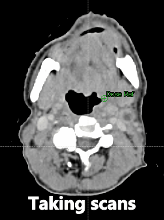
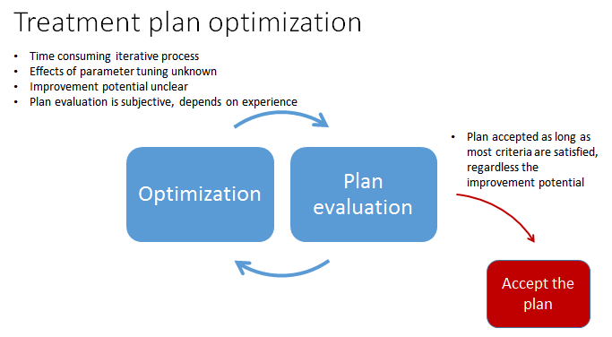
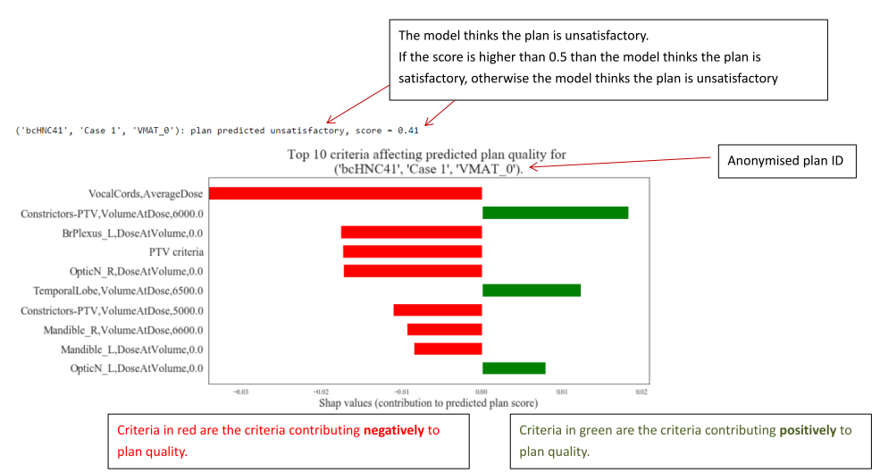

# Radiotherapy quality evaluation using machine learning
Radiotherapy treatment is one of the most effective non-surgical cancer treatment modality. 
It uses external ionising radiotherapy to control or eliminate cancerous cells. 

The planning process for radiotherapy treatments consists of repeated __plan optimization__ and 
__plan evaluation__. The planner needs to set some optimization parameters in a commercial treatment planning software 
in order to generate a plan. The plan is evaluated based on a list of treatment evaluation criteria, 
the so-callede dose-volume histograms and the spatial 
dose distributions (examined through 2D slices of the treatment site). 

Due to patient specific geometrical structural variations, evaluating the quality of a plan is difficult. 
Clinical evvaluation protocols are based on population-based statistics and are not specifically designed to a
patient. If a plan is not deemed satisfactory, the planner adjusts the optimization 
parameters in order to improve the plan. The optimization process can take serveral minutes and 
it is uncertain if the adjustment will lead to 
an improvement. As a consequence, a treatment plan tends to be accepted as long as it achieves the 
minimal requirements. 

In this work, we develop a data-driven plan evaluation tool using machine learning 
techniques. We build a classification model that predicts plan acceptability based 
on the geometrical features and the radiation dose to different structures. The model results
are feed into a model interpreter which will show the strengths and weaknesses 
of a given plan. The planner will be able to make unbiased evaluation on the plan 
quality hence saves time in the planning process and ensures the plan quality is truly
optimal.

## Example of the plan evaluation output

The figure above is an annotated screen shot of the model interpreter for a plan. In this 
example we can see the classification score is less than 0.5, suggesting the plan is 
unsatisfactory. The bar plot shows the top criteria affecting the predicted plan 
quality. Criteria in red/green are the criteria contributing negatively/positively 
to plan quality. The planner can read from this plot to identify the strength and weaknesses 
of a given plan to make an informed evaluation on plan quality and improvement potential. 

